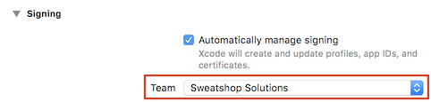
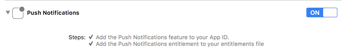
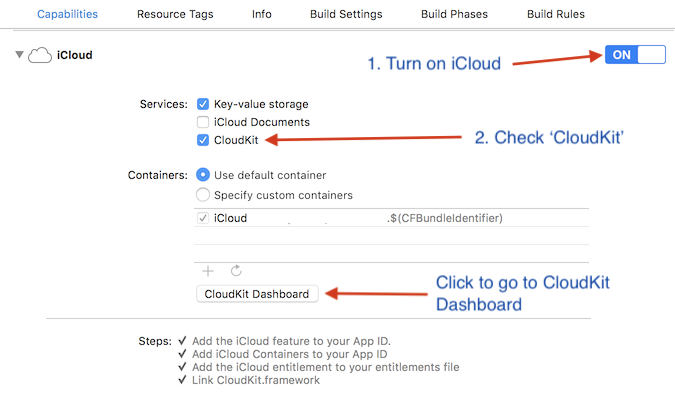
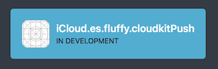
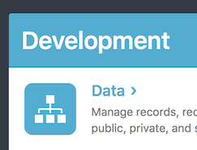
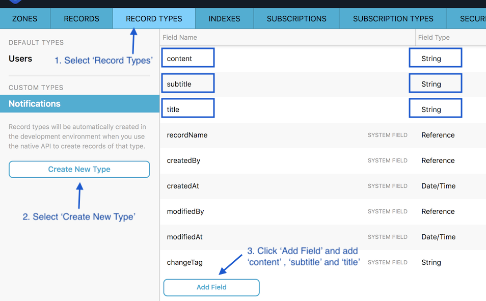
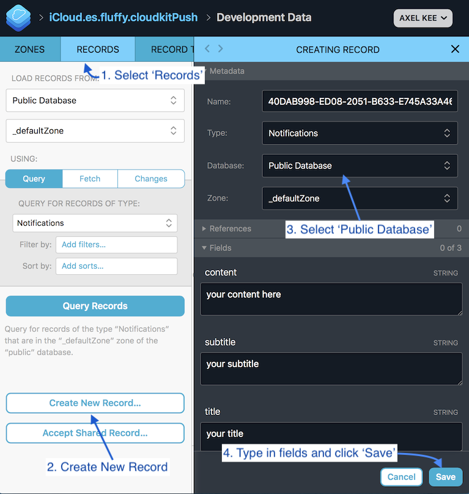
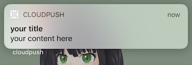

# Easy Push Notification using Apple's Cloudkit

## Prerequisite

1. You must have a paid Apple developer account, or have access to one
2. You will need a real iOS device to test it as push notification only works on physical iOS device

## Project Steps

1. Select a valid Apple account in the project's Signing Team 

2. Enable **Push Notification** in the App Target > Capabilities

3. Enable **iCloud** in the App Target > Capabilities

## Cloudkit Dashboard Steps

1. Click the **Cloudkit Dashboard** button shown previously to go the Apple CloudKit Dashboard, or go to https://icloud.developer.apple.com/dashboard/ .
2. Open the container for your app

3. Select Development > Data

4. Select **Record Types**, Create a new type named **Notifications**. And add fields named **content**, **subtitle** and **title**. Click Save.

## App Steps

1. Build and run the app, and tap allow notifications.

## Cloudkit Dashboard Steps

1. Go back to Cloudkit Dashboard, select the app container and Development > Data.
2. Create a new record on 'Notifications' Type.
   

See the notification appear on your phone 🎉

## Notes

After your app went live in App Store, you will need to go to the Production > Data in CloudKit Dashboard to create the Notification. And this notification will go to all the app users (who have allowed push notification)